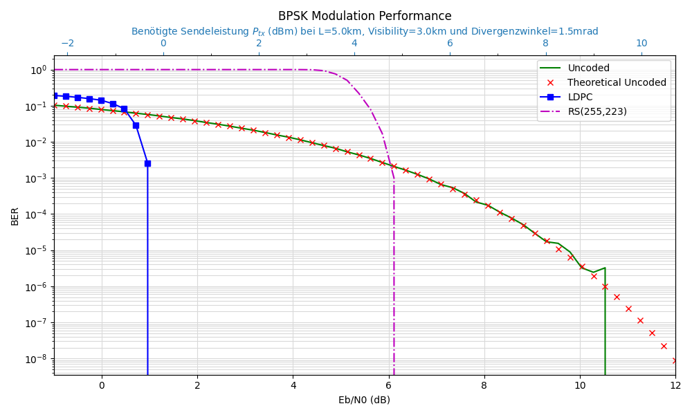
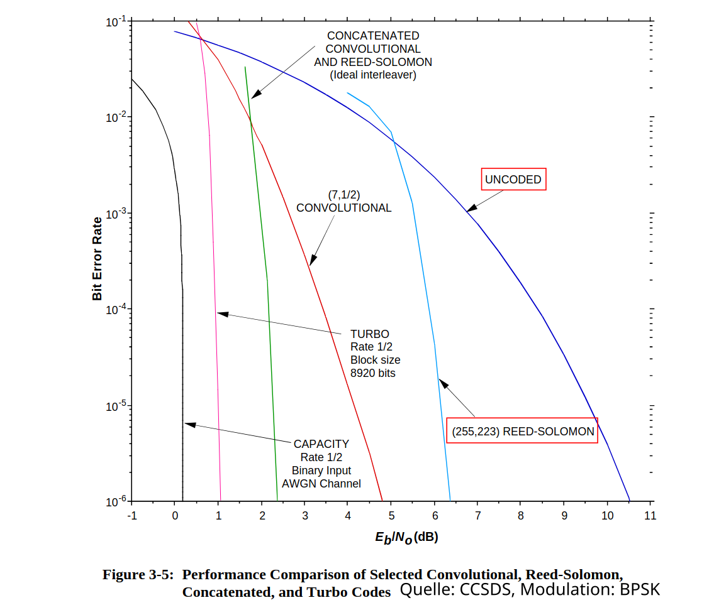
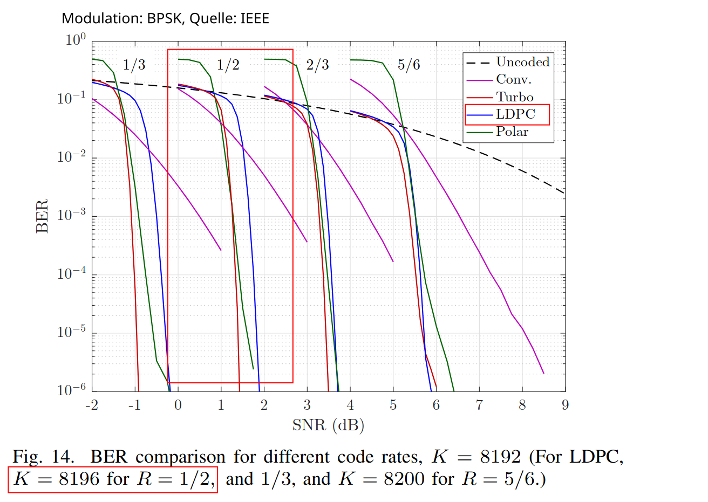

# Free Space Optical Simulation Tool (FrOST) 

**Version:**    1.0.0  
**Status:**     Completed (Master's Module Project)  
**Autor:**      Robin Graf  
**Lizenz:**     --  
**Letztes Update:** Mai 2026  

*(ehemals: optical-satcom-sim)*

FrOST ist ein Python-basiertes Simulationswerkzeug zur Evaluierung und Systemauslegung optischer Freiraumkommunikationsstrecken (Free Space Optics, FSO).
Es schlägt eine Brücke zwischen der physikalischen Kanalmodellierung (Atmosphärendämpfung, Link-Budget) und der nachrichtentechnischen Signalauswertung auf dem Physical Layer.

Entwickelt wurde das Projekt im Rahmen einer Modularbeit im Masterstudium Elektrotechnik/Informationstechnik (Vertiefung: Kommunikationstechnik). Der Fokus liegt auf strikter Wiederverwendbarkeit, Erweiterbarkeit und wissenschaftlicher Nachvollziehbarkeit.

**Kernfunktionen**
* **Physikalische Kanalmodellierung:** Übersetzung der Dämpfungseffekte einer optischen Strecke in ein Link-Budget unter realistischen Bedingungen.
* **Fehlerkorrektur-Verfahren:** Simulation und Vergleich uncodierter Übertragungen mit Reed-Solomon (RS) und LDPC-Kanalcodierungen.
* **Leistungsbewertung:** Präzise Analyse der Bitfehlerhäufigkeit (BER) als Funktion des Signal-Rausch-Verhältnisses ($E_b/N_0$) sowie der resultierenden Sendeleistung ($P_{tx}$).


> **Hinweis:** Diese Dokumentation dient nur als technische Referenz und Bedienungsanleitung für das Software-Tool.

---

## 1. Funktionsumfang & Kanalmodelle

Die Simulation führt den Bitstrom durch eine komplette DSP-Kette und modelliert den FSO-Kanal mit folgenden physikalischen und stochastischen Effekten:

* **Modulationsverfahren:** 
    * Optical On-Off Keying (O3K)
    * Binary Phase-Shift Keying (BPSK)
* **Forward Error Correction (FEC):** 
    * Uncoded (Referenzabgleich zwischen theoretischer Berechnung und Simulation)
    * Reed-Solomon (RS)
    * Low-Density Parity-Check (LDPC) via *Sionna*
* **FSO-Kanal-Effekte:**
    * Geometric Loss: Deterministischer Verlust durch Strahlausbreitung (Divergenz) in Relation zur Empfänger-Apertur, berechnet über die Gaußsche Fehlerfunktion.
    * Atmospheric Loss: Atmosphärische Extinktion durch Nebel und Dunst, modelliert nach dem Kim-Modell (in Abhängigkeit von der meteorologischen Sichtweite und Wellenlänge).
    * Receiver Noise (AWGN): Angenommen als rein dominantes thermisches Rauschen der Auswerteelektronik. Die stochastische Störung auf Bitebene erfolgt über einen AWGN-Kanal, dessen Rauschvarianz exakt an das berechnete Signal-Rausch-Verhältnis des Link-Budgets gekoppelt wird.

### Block Diagram der DSP-Kette


### Mathematische Modelle

Für die Simulation des FSO-Kanals und die Validierung der Ergebnisse werden verschiedene etablierte mathematische Modelle implementiert.

#### Theoretische uncodierte BER-Berechnung

Um die Ergebnisse der empirischen Monte-Carlo-Simulation für den uncodierten Fall zu verifizieren, wird ein theoretischer Referenzwert berechnet. Dieser basiert auf der exakten Fehlerwahrscheinlichkeit für BPSK/OOK über einen AWGN-Kanal:

$$P_b = \frac{1}{2} \text{erfc} (\sqrt{\frac{E_b}{N_0}})$$

**Quelle:** Gleichung 4.3, Principles of Digital Communication II, Prof. David Forney, Electrical Engineering and Computer Science (MIT), 2005.

#### FSO-Kanal-Effekte & Link-Budget

Die Übersetzung der gewünschten Sendeleistung in das für die Signalverarbeitung relevante $E_b/N_0$ erfolgt über die Modellierung dreier physikalischer Haupteffekte:

##### A: Geometrischer Verlust (Beam Spreading)
Durch die Divergenz des Laserstrahls $\theta$ weitet sich der Strahl über die Distanz $L$ auf. Der Radius des Strahls am Empfänger $w_L$ wird genähert als:

$$w_L = \frac{\theta}{2} \cdot L$$

Der Anteil der optischen Leistung, der von der Empfängerlinse (mit Radius $r_{rx}$) eingefangen wird, ergibt den geometrischen Verlust $h_{geo}$. Unter Annahme eines Gaußschen Strahlprofils gilt:

$$h_{geo} = \left[ \text{erf} \left( \frac{\sqrt{\pi} \cdot r_{rx}}{\sqrt{2} \cdot w_L} \right) \right]^2$$


##### B: Atmosphärische Dämpfung (Kim-Modell)

Die Extinktion durch Nebel und Dunst wird empirisch über das Kim-Modell abgebildet. Der atmosphärische Transmissionsfaktor $h_{atm}$ folgt dem Beer-Lambert-Gesetz:

$$h_{atm} = e^{-\sigma \cdot L}$$

Der Dämpfungskoeffizient $\sigma$ hängt stark von der meteorologischen Sichtweite $V$ (Visibility) und der Wellenlänge $\lambda$ ab:

$$\sigma = \frac{3.91}{V} \left( \frac{\lambda}{550 \text{ nm}} \right)^{-q}$$

Der Parameter $q$ regelt die Partikelgrößenverteilung und variiert je nach Sichtweite (z.B. $q = 1.3$ für $V > 6\text{ km}$, oder $q = 0.585 \cdot V^{1/3}$ für dichteren Nebel).

**Quelle:** Gleichung (10), Kim, Isaac I., Bruce McArthur, and Eric J. Korevaar. "Comparison of laser beam propagation at 785 nm and 1550 nm in fog and haze for optical wireless communications." Optical wireless communications III. Vol. 4214. Spie, 2001.

##### C: Empfängerrauschen & SNR
In der aktuellen Ausbaustufe geht FrOST von einem System aus, das durch thermisches Rauschen (Johnson-Nyquist-Rauschen) des Abschlusswiderstands limitiert ist. Die Varianz des Rauschstroms $\sigma_{th}^2$ berechnet sich aus der Boltzmann-Konstante $k_B$, der Temperatur $T$, der Datenrate $R_{data}$ (als Näherung für die elektrische Bandbreite) und dem Lastwiderstand $R_{load}$:

$$\sigma_{th}^2 = \frac{4 \cdot k_B \cdot T \cdot R_{data}}{R_{load}}$$

Die empfangene optische Leistung $P_{rx}$ und der resultierende Signalstrom $I_{sig}$ (mit der Responsivity $R_{resp}$ der Photodiode) sind:

$$P_{rx} = P_{tx} \cdot h_{geo} \cdot h_{atm}$$
$$I_{sig} = P_{rx} \cdot R_{resp}$$

Das elektrische Signal-Rausch-Verhältnis (SNR) am Empfänger lautet somit:

$$\text{SNR} = \frac{I_{sig}^2}{\sigma_{th}^2}$$

Für einfache Modulationsverfahren (wie OOK/BPSK) lässt sich das SNR direkt in das für die Signalverarbeitungskette relevante $E_b/N_0$ übersetzen, wodurch die Brücke zwischen der optischen Physik und der digitalen Nachrichtentechnik geschlossen wird.


---

## 2. Systemanforderungen & Installation

Das Projekt erfordert Python 3.8 bis 3.10 und basiert auf gängigen Data-Science- sowie Kommunikations-Frameworks. Durch die Nutzung von TensorFlow und Sionna profitiert das Tool von Hardwarebeschleunigung, läuft standardmäßig aber problemlos auf der CPU.

### Lokale Installation

**1. Repository klonen und in den Ordner wechseln:**
```bash
git clone https://github.com/r-graf/FrOST.git
cd FrOST
```

**2. Virtuelles Environment erstellen und aktivieren (Empfohlen):**
```bash
# Unter Linux/macOS:
python3 -m venv venv
source venv/bin/activate

# Unter Windows:
python -m venv venv
venv\Scripts\activate
```

**3. Abhängigkeiten installieren:**
```bash
pip install -r requirements.txt
```
**Hauptabhängigkeiten:** `sionna`, `tensorflow`, `numpy`, `scipy`, `matplotlib`, `reedsolo`, `pyyaml`)

## 3. Projektstruktur

Das Projekt ist modular aufgebaut, um die Konfiguration, die physikalische Modellierung und die nachrichtentechnische Auswertung sauber voneinander zu trennen:

```bash
FrOST/
├── src/
│   ├── osc_sim.py       # Ausführungsskript: Orchestriert die Simulation (BER vs. Eb/N0)
│   ├── osc_def.py       # Kerndefinitionen: DSP-Kette, FEC (RS/LDPC), Kanalmodelle & Plot-Logik
│   └── config.yaml      # Zentrale Konfiguration: Parameter für das FSO-Link-Budget
├── requirements.txt     # Übersicht der benötigten Python-Bibliotheken
└── README.md            # Diese Dokumentation
```
**Dateidetails:**
* `src/osc_sim.py`: Das Haupt- und Ausführungsskript. Es lädt die Parameter aus der Konfiguration, generiert den initialen Bitstrom und startet die Hauptschleife der Simulation über den definierten $E_b/N_0$-Bereich.
* `src/osc_def.py`: Das Herzstück der Simulation. Beinhaltet die OpticalSatcomChain sowie das Link-Budget-Modell (get_fso_link_offset). Hier ist die gesamte physikalische und stochastische Logik (Sionna-Tensoren, Modulatoren, AWGN-Kanal, Error-Counting) gekapselt.
* `src/config.yaml`: Erlaubt die schnelle Anpassung der FSO-Link-Parameter (wie meteorologische Sichtweite, Distanz, Empfänger-Apertur und Wellenlänge), ohne dass Eingriffe in den Python-Code nötig sind.

## 4. Konfiguration (`config.yaml`)

Die Parameter für die Freiraumstrecke und den Empfänger werden zentral in der `src/config.yaml` definiert. Diese Parameter bestimmen, wie sich der FSO-Kanal auf das gesendete Signal auswirkt:

**Link Parameter (`link_params`):**
|Parameter	    |Einheit    | Beschreibung                                                  |
|---            |---        |---                                                            |
|L_km	        |km	        |Distanz der Kommunikationsstrecke.                             |
|visibility_km	|km	        |Meteorologische Sichtweite (bestimmt Dämpfung im Kim-Modell).  |
|wavelength_nm	|nm	        |Wellenlänge des Lasers (z. B. 1550.0).                         |
|theta_mrad	    |mrad       |Divergenzwinkel des Sendestrahls.                              |

**Receiver Parameter (`receiver_params`):**
|Parameter      |Einheit    |Beschreibung                                       |
|---            |---        |---                                                |
|rx_aperture_cm	|cm	        |Durchmesser der Empfängerlinse.                    |
|R_resp	        |A/W	    |Responsivity (Wirkungsgrad) der Photodiode.        |
|data_rate	    |Hz	        |Datenrate des Systems (z. B. 1.0e+9 für 1 Gbps).   |
|T_kelvin	    |K	        |Rauschtemperatur des Empfängers.                   |
|R_load	        |Ohm        |Lastwiderstand (bestimmt Thermal Noise).           |

**Konstanten (`constants`):**
|Parameter      |Einheit    |Beschreibung                                       |
|---            |---        |---                                                |
|kB	            |J/K	    | Boltzmann-Konstante (i. d. R. 1.38e-23).          |
|q_charge	    |C	        | Elementarladung (i. d. R. 1.602e-19).             |

**Struktur der `config.yaml`:**
```yaml
link_params:
  L_km: 2.0
  visibility_km: 4.0
  wavelength_nm: 1550.0
  theta_mrad: 1.5

receiver_params:
  rx_aperture_cm: 10.0
  R_resp: 0.9
  data_rate: 1.0e+9
  T_kelvin: 300.0
  R_load: 50.0

constants:
  kB: 1.38e-23
  q_charge: 1.602e-19
```

## 5. Ausführung & Nutzung (Usage)

Um die vollständige Bit-by-Bit-Simulation über den definierten $E_b/N_0$-Bereich (Standard: -1 dB bis 12 dB) zu starten, führe das Hauptskript aus:
```bash
python src/osc_sim.py
```

**Simulationsparameter anpassen:**

Die Parameter für den Simulationsdurchlauf können direkt in der Datei src/osc_sim.py (ab ca. Zeile 30) im Aufruf der Funktion OpticalSatcomChain angepasst werden:

```python
results = osc_def.OpticalSatcomChain(
    b, 
    config, 
    "bpsk",         # Modulation ("bpsk" oder "o3k")
    ebn0_min=-1,    # Startwert Eb/N0 in dB
    ebn0_max=12,    # Endwert Eb/N0 in dB
    simsteps=54,    # Anzahl der Messpunkte
    ldpc=True,      # LDPC-Codierung simulieren
    RS=True         # Reed-Solomon-Codierung simulieren
)
```
**Erwarteter Output**

Während der Ausführung loggt das Tool den Fortschritt der iterativen BER-Berechnung für den uncodierten Fall sowie für LDPC und RS in die Konsole. Am Ende der Berechnungen wird zudem die Link-Budget-Verifikation ausgegeben und es öffnet sich automatisch ein Matplotlib-Fenster, das die BER-Kurven grafisch darstellt.

Beispielhafter Konsolen-Output:

```
K: number of codeword bits (output Coder):       n =  16384
N: number of information bits (input Coder):     k =  8192
R: Code rate:                                    r =  0.5

Modulation:     bpsk
Constellation:  [-1.+0.j  1.+0.j]

Results: Eb/N0 =  -1.0 dB,   n0 =  1.2589254 dB
Math.     BER  =  0.1037590959534063
uncoded:  BER  =  0.10410888671875

...

Modulation:     bpsk

Results: Eb/N0 = -1.0 dB,   n0 =  2.5178509 dB
LDPC:     BER  =  0.19246907552083334

...

Results: Eb/N0 = 6.3584905660377355 dB,   n0 =  1.4313537 dB
RS:       BER  =  0.0 at  1784000 Bits and with Bit Errors:  0

--- LINK BUDGET VERIFIKATION ---
Linklänge:               5.0 km
Visibilität:             3.0 km
Divergenzwinkel:         1.5 mrad
Geometrischer Verlust:   -34.49 dB
Atmosphärischer Verlust: -11.81 dB
Totaler Kanal-Verlust:   -46.30 dB
Thermische Rauschleistung: 3.31e-13 A^2
Signalstrom bei 30 dBm:    2.11e-05 A
Resultierendes Eb/N0:    31.29 dB
--------------------------------
```

## 6. Auswertung & Visualisierung (Ergebnisse)

Am Ende des Simulationsdurchlaufs (osc_sim.py) wertet das Tool die gesammelten Daten automatisch aus und generiert einen Matplotlib-Plot, der direkt betrachtet und über die GUI gespeichert werden kann. Dieser Plot visualisiert die empirischen BER-Kurven für die uncodierte Übertragung sowie für die RS- und LDPC-Codierung und stellt sie der mathematischen AWGN-Theoriekurve gegenüber. Ein besonderes Merkmal ist die zweite X-Achse im oberen Bereich der Grafik: Hier wird das $E_b/N_0$ direkt in die theoretisch berechnete, erforderliche Sendeleistung ($P_{tx}$) übersetzt, basierend auf den konfigurierten FSO-Link-Parametern.

<p align="center">
    
</p>

*Beispielhafter Plot des FrOST-Tools. Da die empirische Monte-Carlo-Simulation für eine fixe Anzahl an Übertragungsbits läuft, treten ab einem ausreichend hohen $E_b/N_0$-Wert keine Bitfehler mehr auf (BER = 0). Aufgrund der logarithmischen Skalierung der Y-Achse (wo der Wert 0 mathematisch minus unendlich entspricht) brechen die empirischen Kurven an diesen Punkten optisch ab.*

## 7. Validierung gegen die Literatur

Um die Korrektheit der implementierten Simulationskette und der stochastischen Modelle zu verifizieren, wurden die mit FrOST ermittelten Bitfehlerkurven mit standardisierten Referenzkurven aus der Fachliteratur abgeglichen.

### 7.1. Validierung: Uncodiert & Reed-Solomon (RS)

Der Abgleich für die uncodierte BPSK-Übertragung und die Reed-Solomon-Codierung erfolgt anhand des offiziellen Informationsberichts des Consultative Committee for Space Data Systems (CCSDS). Die Simulationsergebnisse von FrOST decken sich exakt mit den dort dokumentierten theoretischen und empirischen Verläufen.

<p align="center">
    
</p>

**Quelle:** Synchronization, T. M. "Channel coding—summary of concept and rationale." Report Concerning Space Data System Standard. Informational Report CCSDS (2012).

### 7.2. Validierung: Low-Density Parity-Check (LDPC)

Die Validierung des hochperformanten LDPC-Verfahrens (5G-konformer Code via Sionna) basiert auf einem Vergleich mit den IEEE-Referenzmessungen von Tahir et al. Der für LDPC typische, extrem steile Leistungsabfall (Waterfall-Region) bei ansteigendem $E_b/N_0$ wird von FrOST präzise reproduziert.

<p align="center">
    
</p>

**Quelle:** Tahir, Bashar, Stefan Schwarz, and Markus Rupp. "BER comparison between Convolutional, Turbo, LDPC, and Polar codes." 2017 24th international conference on telecommunications (ICT). IEEE, 2017.